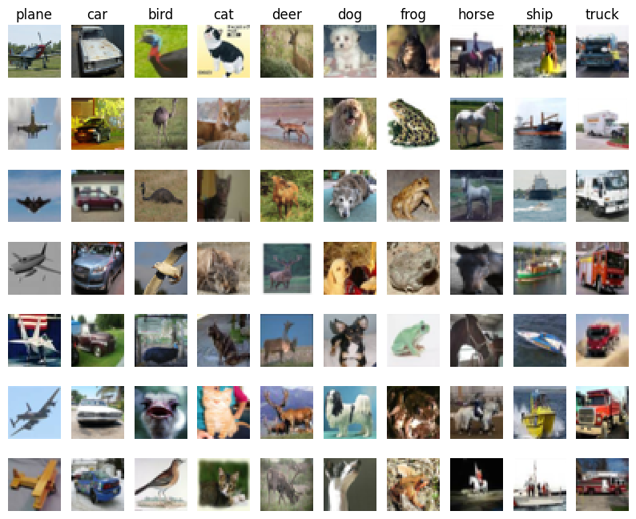
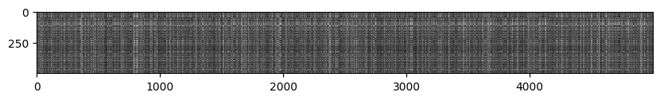
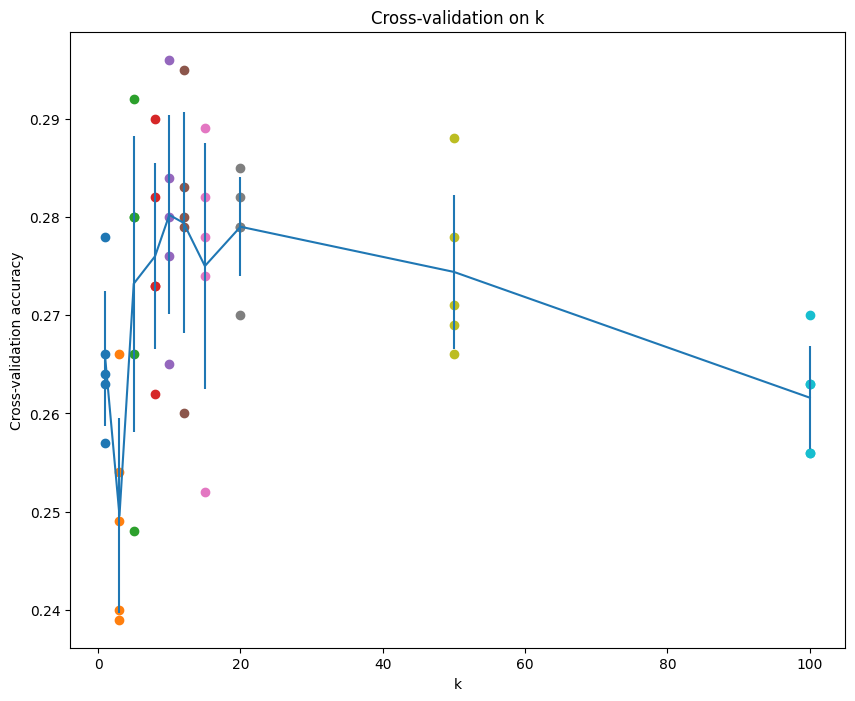

# CS231n Assignment1 KNN 笔记

本文为 2026 年 CS231n assignment1的笔记，包含 `knn.ipynb` 的全部内容。

主要内容

* 完成 KNN 分类器的数据准备流程：挂载云端硬盘、加载 CIFAR-10 数据集、数据集抽样可视化，降采样
* 采取多种方法计算样本之间的距离，领会向量化编程的速度优势
* 实现 `predict_labels`，理解多数投票与平票处理
* 采用交叉验证的方法选取最优的超参数 k

---

## 一、环境准备与数据加载

### 1.1 挂载 Google Drive

这一步骤的内容可以参考助教给出的Software Setup：[Software Setup](https://cs231n.github.io/setup-instructions/) 正确配置运行环境和文件夹。

**题目**

在 Colab 中挂载 Google Drive，使运行时能够读取存放在云端硬盘里的作业代码与数据集。

**解析**

1. `drive.mount('/content/drive')` 把云端硬盘挂到 Colab 虚拟机的 `/content/drive` 路径下；
2. `sys.path.append(...)` 把作业文件夹加进 Python 的模块搜索路径 —— 这一步是关键，否则后面 `from cs231n.classifiers import KNearestNeighbor` 会因为找不到包而报错；
3. 先 `cd` 进数据集目录执行 `get_datasets.sh` 下载 CIFAR-10，再 `cd` 回作业根目录。

`FOLDERNAME` 后的 `assert` 是一道保险：如果忘了填文件夹名，会立刻以 `[!] Enter the foldername.` 中断，而不是在后面某处抛出难以定位的错误。

**代码**

```python
# This mounts your Google Drive to the Colab VM.
from google.colab import drive
drive.mount('/content/drive')

# TODO: Enter the foldername in your Drive where you have saved the unzipped
# assignment folder, e.g. 'cs231n/assignments/assignment1/'
FOLDERNAME = 'cs231n/assignments/assignment1/'
assert FOLDERNAME is not None, "[!] Enter the foldername."

# Now that we've mounted your Drive, this ensures that
# the Python interpreter of the Colab VM can load
# python files from within it.
import sys
sys.path.append('/content/drive/My Drive/{}'.format(FOLDERNAME))

# This downloads the CIFAR-10 dataset to your Drive
# if it doesn't already exist.
%cd /content/drive/My\ Drive/$FOLDERNAME/cs231n/datasets/
!bash get_datasets.sh
%cd /content/drive/My\ Drive/$FOLDERNAME

#这一段代码是让谷歌硬盘访问代码文件夹
```

运行输出：

```text
Drive already mounted at /content/drive; to attempt to forcibly remount, call drive.mount("/content/drive", force_remount=True).
/content/drive/My Drive/cs231n/assignments/assignment1/cs231n/datasets
/content/drive/My Drive/cs231n/assignments/assignment1
```

---

### 1.2 导入工具函数

**题目**

导入后续要用的库，并配置绘图参数与模块自动重载。

**解析**

* 略

**代码**

```python
# Run some setup code for this notebook.

import random
import numpy as np
from cs231n.data_utils import load_CIFAR10
import matplotlib.pyplot as plt

# This is a bit of magic to make matplotlib figures appear inline in the notebook
# rather than in a new window.
%matplotlib inline
plt.rcParams['figure.figsize'] = (10.0, 8.0) # set default size of plots
plt.rcParams['image.interpolation'] = 'nearest'
plt.rcParams['image.cmap'] = 'gray'

# Some more magic so that the notebook will reload external python modules;
# see http://stackoverflow.com/questions/1907993/autoreload-of-modules-in-ipython
%load_ext autoreload
%autoreload 2

#以上代码都是导入工具函数，属于环境准备
```

---

### 1.3 加载 CIFAR-10 数据

**题目**

读取 CIFAR-10 原始数据，并打印各数组的形状做一次正确性检查。

**解析**

`load_CIFAR10` 返回四个数组。加载前的 `try/except` 块先用 `del` 清掉可能已存在的同名变量 —— 注释里点明了动机：**避免重复加载导致Colab的内存溢出**。

观察一下打印的形状，可以看出这两个NumPy数组的shape：训练集 50000 张，测试集 10000 张，每张大小 32×32，每个像素有RGB三个通道。

**代码**

```python
# Load the raw CIFAR-10 data.
cifar10_dir = 'cs231n/datasets/cifar-10-batches-py'

# Cleaning up variables to prevent loading data multiple times (which may cause memory issue)
try:
   del X_train, y_train
   del X_test, y_test
   print('Clear previously loaded data.')
except:
   pass

X_train, y_train, X_test, y_test = load_CIFAR10(cifar10_dir)

# As a sanity check, we print out the size of the training and test data.
print('Training data shape: ', X_train.shape)
print('Training labels shape: ', y_train.shape)
print('Test data shape: ', X_test.shape)
print('Test labels shape: ', y_test.shape)

#以上代码实现数据的加载，以及数据集尺寸的检查
#可以看出，训练集包含50000张三通道图片，测试集包含10000张三通道图片，大小都是32*32
```

运行输出：

```text
Clear previously loaded data.
Training data shape:  (50000, 32, 32, 3)
Training labels shape:  (50000,)
Test data shape:  (10000, 32, 32, 3)
Test labels shape:  (10000,)
```

---

### 1.4 数据集可视化

**题目**

从每个类别中随机抽取若干张图片，排成网格展示，直观观察数据集的样子。

**解析**

这一节代码不长但信息密度很高，注释里逐行拆解了几处 NumPy 技巧，体现了NumPy的“微言大义”：

* **`np.flatnonzero(y_train == y)`** —— 注释点明它内部其实是三步：先 `y_train == y` 广播生成一个长度 50000 的布尔数组，再拍平，最后取出其中非零（即 `True`）元素的索引。一行代码完成了「筛选出所有属于第 y 类的样本下标」。
* **`np.random.choice(idxs, samples_per_class, replace=False)`** —— 从候选下标中随机抽 7 个，`replace=False` 表示不重复抽取。
* **子图编号 `plt_idx = i * num_classes + y + 1`**。`plt.subplot` 按**行优先**编号，而这里希望**同一类别占同一列**，于是第 i 张、第 y 类的图被放到编号 `i*10 + y + 1` 的位置。注释里举了第一类的例子：三张图分别是 1、11、21 号，正好落在第一列。

最终排成 7 行 10 列，每列一个类别。

**代码**

```python
# Visualize some examples from the dataset.
# We show a few examples of training images from each class.
classes = ['plane', 'car', 'bird', 'cat', 'deer', 'dog', 'frog', 'horse', 'ship', 'truck']
num_classes = len(classes)
samples_per_class = 7
#定义名字列表，类别数量，每个类别数量展示几张图片
for y, cls in enumerate(classes):
    #枚举类型，遍历列表同时拿到索引(类别编号y)和值(类别名称)
    #x_train的形状(50000,32,32,3)，图片
    #y_train的形状(50000,),类别
    idxs = np.flatnonzero(y_train == y)
    #这里np.flatnonzero(array)返回一个一维数组
    #包含所有a拍平（按照行优先展开）的非零项的索引
    #具体来说，y_train==y进行一次广播生成数组(50000,)
    #然后进行一次可有可无的拍平，再取出布尔数组中非0值的索引
    #一行代码总共展现了三个步骤
    idxs = np.random.choice(idxs, samples_per_class, replace=False)
    #这里是随机选取samples_per_class个,replace=False表示不重复选取
    #至此得到了训练数据中，每个类别的索引列表idxs

    #对当前类别的每一张随机图片，要计算放在网格的哪里
    #plt的网格坐标从1开始，按照行优先的方法排列
    for i, idx in enumerate(idxs):
        plt_idx = i * num_classes + y + 1
        #计算每个子图的编号，计算结果是
        #第一类:第一张是1号，第二张是1*10+0+1=11号，第三张2*10+0+1=21号
        #这样一来第一类都在第一列
        plt.subplot(samples_per_class, num_classes, plt_idx)
        #绘制一个子图网格，行数7，列数10，第三个参数是当前绘制的子图的索引编号
        #下面的操作都在这个索引编号的子图里面进行
        plt.imshow(X_train[idx].astype('uint8'))
        #取第idx张图片，转为uint8类型显示在这个子图位置上
        plt.axis('off')
        #隐藏坐标轴
        if i == 0:
            plt.title(cls)
        #打印类别名称
plt.show()
#打开窗口

#以上的代码实现的是数据集的“可视化"
#每一类图片都随机抽取7张，一共有10类，把他们排成7行10列，然后展示出来
#目的是大概观察数据集的样子
```

运行结果：



---

### 1.5 降采样与展平

**题目**

为了后续实验跑得动，把训练集降到 5000 张、测试集降到 500 张，并把每张 32×32×3 的图片展平成一维向量。这里降采样是为了加速，后续训练测试都在这个子集上面完成；而展平是为了方便计算，这是因为按照线性分类器的定义，每张图片像素地位一样，可以看成一个一维数组进行运算。

**解析**

两个操作：

* **降采样**

  用花式索引（fancy indexing）完成：

  以 `list` 作为索引列表时，默认作用于多维数组的**第一维**，等价于 `X_train[mask, :, :]`。多维场景下也可以写成 `array[row_idxs, col_idxs]` 用两个一维数组分别索引。

* **展平**

  用 `np.reshape(X_train, (X_train.shape[0], -1))`。`-1` 是自动推断占位符，告诉 numpy「第一维保持 5000 不变，剩下的维度你自己算」。32×32×3 = 3072，于是得到 (5000, 3072)。

这一步是全流程的关键铺垫：KNN 计算距离时把每张图片当成 3072 维空间中的一个点，后续所有距离公式都建立在这个形状上。

至此，X_train和X_test经过拍平，形状变为(50000,3072)和(5000,3072)即两个2D矩阵。

**代码**

```python
# Subsample the data for more efficient code execution in this exercise
num_training = 5000
mask = list(range(num_training))
X_train = X_train[mask]
y_train = y_train[mask]
#花式索引
#numpyarray[list]，list是想要取出的位置索引，numpyarray是多维数组
#一维数组作为索引，默认作用于多维数组的第一维，相当于X_train[mask,:,:]
#例子：如果待处理的是二维数组，可以写成array[row_idxs,col_idxs]，用两个一维数组

#具体来说，这里取X_train和y_train这两个数组的前5000个元素，就是一个降采样

num_test = 500
mask = list(range(num_test))
X_test = X_test[mask]
y_test = y_test[mask]
#和刚才一样取了X_test和y_test前500组元素，就是前500组测试数据

# Reshape the image data into rows
X_train = np.reshape(X_train, (X_train.shape[0], -1))
#reshape函数的自动推断占位符，作用就是让函数自动推断这个维度的大小
#具体来说，为了方便计算，我们希望
#新的shape应该是把每张图片都展平成一维数组
#那么第一个维度保留，剩下的维度可以用自动推断，算出应该有多少个元素
X_test = np.reshape(X_test, (X_test.shape[0], -1))
#和上面一样，对测试集进行拍平处理，变成5000个一维数组

print(X_train.shape, X_test.shape)
#验证，应该输出(5000,3072)以及(500,3072)

#以上的代码实现的是数据集的降采样和拍平
```

运行输出：

```text
(5000, 3072) (500, 3072)
```

---

### 1.6 创建分类器实例

**题目**

实例化 KNN 分类器并把训练数据交给它。

**解析**

`KNearestNeighbor` 的 `train` 方法是一个空操作 —— 注释里写得很直白：**「training a kNN classifier is a noop」**。KNN 属于「懒惰学习」（lazy learning），训练阶段只是把数据记下来，真正的计算全部推迟到预测时。

注意，单纯记录数据，实际上也是学习(单纯的记忆过程)，在后续预测过程中，训练数据会起到作用，这就是模型学习过程的体现。

**代码**

```python
from cs231n.classifiers import KNearestNeighbor

# Create a kNN classifier instance.
# Remember that training a kNN classifier is a noop:
# the Classifier simply remembers the data and does no further processing
classifier = KNearestNeighbor()
classifier.train(X_train, y_train)
#创建一个KNearestNeighbour实例对象
#用train属性记录数据
```

---

## 二、计算距离

KNN 算法的原理十分简单：

训练期间只将训练集的样本存储起来，不做任何操作；

测试时分别计算测试样本和训练集中的每个样本的距离，然后选取距离最近的 k 个样本的标签信息来进行分类，常用的是多数投票（Major Vote）。

因此，在 KNN 算法的部署过程中，核心步骤就是**图片之间距离的计算**。

假设训练集有 `num_train` 个样本，测试集有 `num_test` 个样本，那么距离矩阵 `dists` 应该是一个 `num_test × num_train` 的矩阵。这里，我们采用两个一维向量之间的L2范数定义距离。

本作业要求用三种方式实现同一个 `compute_distances` 函数，逐级去掉循环，体会向量化带来的差距。

### 2.1 方法一：Two Loops

**题目**

用双层循环分别计算每个测试样本和每个训练样本之间的距离，逐个填入距离矩阵。

**解析**

这是最直白的实现：外层遍历测试样本，内层遍历训练样本，对每一对计算 L2 距离。

距离的展开方式是 `np.sqrt(np.sum((X[i] - self.X_train[j]) ** 2, axis=0))` —— 先求差、再平方、再沿 `axis=0` 求和、最后开根号。因为 `X[i]` 和 `self.X_train[j]` 都是长度为 3072 的向量，这里 `axis=0` 遍历的就是这 3072 个特征。

**代码**（`k_nearest_neighbor.py`）

```python
def compute_distances_two_loops(self, X):
    """
    Compute the distance between each test point in X and each training point
    in self.X_train using a nested loop over both the training data and the
    test data.

    Inputs:
    - X: A numpy array of shape (num_test, D) containing test data.

    Returns:
    - dists: A numpy array of shape (num_test, num_train) where dists[i, j]
      is the Euclidean distance between the ith test point and the jth training
      point.
    """
    num_test = X.shape[0]
    num_train = self.X_train.shape[0]
    dists = np.zeros((num_test, num_train))
    #对每一个测试数据，计算它和每一个训练数据的距离
    for i in range(num_test):
        for j in range(num_train):
            #####################################################################
            # TODO:     
            dists[i,j]=np.sqrt(np.sum((X[i]-self.X_train[j])**2,axis=0))                                                        #
            # Compute the l2 distance between the ith test point and the jth    #
            # training point, and store the result in dists[i, j]. You should   #
            # not use a loop over dimension, nor use np.linalg.norm().          #
            #####################################################################
    return dists
```

调用与验证：

```python
# Open cs231n/classifiers/k_nearest_neighbor.py and implement
# compute_distances_two_loops.

# Test your implementation:
dists = classifier.compute_distances_two_loops(X_test)
print(dists.shape)
```

运行输出：

```text
(500, 5000)
```

---

### 2.2 距离矩阵可视化

**题目**

把距离矩阵当成一张灰度图显示出来，观察其中的结构。

**解析**

`plt.imshow(dists, interpolation='none')` 直接绘制矩阵热力图。注释说明了两个细节：这里的 `interpolation='none'` 是**不插值**，避免平滑化掩盖掉数据本身的细节；同时全局 `rcParams` 设置了 `cmap='gray'`，所以**黑色代表距离小、白色代表距离大**。

由于矩阵形状是 500 × 5000（宽高比 1:10），图像被压成一条细长的横条。

**代码**

```python
# We can visualize the distance matrix: each row is a single test example and
# its distances to training examples
plt.imshow(dists, interpolation='none')
plt.show()
#这里把距离矩阵展示为一张图片，不插值（避免平滑化数据细节）
```

运行结果：



---

### 2.3 Inline Question 1

**题目**

Notice the structured patterns in the distance matrix, where some rows or columns are visibly brighter. (Note that with the default color scheme black indicates low distances while white indicates high distances.)

- What in the data is the cause behind the distinctly bright rows?
- What causes the columns?

**解答**

行指标代表的是测试数据索引，列指标代表的是训练数据索引。

那么，明亮的行表示的是所在行的这个测试样本离所有的训练样本的欧氏距离都很远，属于训练集中的离群点。

明亮的列表示的是某一个训练样本离所有测试样本的欧氏距离都很远，意味着这个训练样本是训练集中的离群点，本身相对于测试集缺乏代表性或者可能出现损坏。

---

### 2.4 方法二：One Loop

**题目**

利用 numpy 的广播机制，只保留一层对测试样本的循环，一次算出一个测试样本到所有训练样本的距离。

**解析**

这里展示的是典型的**广播**（broadcasting）应用，注释里把形状推演完整写了出来：

* `X[i]` 的形状是 `(3072,)`，`self.X_train` 的形状是 `(num_train, 3072)`；
* 两者相减时，`X[i]` 被自动广播到每一行，得到形状 `(num_train, 3072)` 的二维数组；
* 这时 `axis=1` 遍历的是**特征维**，`np.sum(..., axis=1)` 把每行的 3072 个平方差求和，得到形状 `(num_train,)` 的一维数组；
* 正好对应 `dists[i, :]` —— 第 i 个测试样本到所有训练样本的距离。

对比方法一：循环次数从 `num_test × num_train` 降到 `num_test`，并且内层全部交给 numpy 的 C 实现。

**代码**（`k_nearest_neighbor.py`）

```python
def compute_distances_one_loop(self, X):
    """
    Compute the distance between each test point in X and each training point
    in self.X_train using a single loop over the test data.

    Input / Output: Same as compute_distances_two_loops
    """
    num_test = X.shape[0]
    num_train = self.X_train.shape[0]
    dists = np.zeros((num_test, num_train))
    for i in range(num_test):
        #######################################################################
        # TODO: 
        #dists[i]的形状(num_test,num_train)
        #X[i]的形状(3072,)
        #self.X_train的形状(num_train,3072) 
        #用广播机制，(X[i]-self.X_train)是二维数组，形状(num_train,3072)
        #测试数据和每个训练数据的距离dists[i,:],形状(num_train,)
        dists[i,:]=np.sqrt(np.sum((X[i]-self.X_train)**2,axis=1))                                                          #
        # Compute the l2 distance between the ith test point and all training #
        # points, and store the result in dists[i, :].                        #
        # Do not use np.linalg.norm().                                        #
        #######################################################################
    return dists
```

调用与验证（用 Frobenius 范数确认与双层循环结果一致）：

```python
# Now lets speed up distance matrix computation by using partial vectorization
# with one loop. Implement the function compute_distances_one_loop and run the
# code below:
dists_one = classifier.compute_distances_one_loop(X_test)

# To ensure that our vectorized implementation is correct, we make sure that it
# agrees with the naive implementation. There are many ways to decide whether
# two matrices are similar; one of the simplest is the Frobenius norm. In case
# you haven't seen it before, the Frobenius norm of two matrices is the square
# root of the squared sum of differences of all elements; in other words, reshape
# the matrices into vectors and compute the Euclidean distance between them.
difference = np.linalg.norm(dists - dists_one, ord='fro')
print('One loop difference was: %f' % (difference, ))
if difference < 0.001:
    print('Good! The distance matrices are the same')
else:
    print('Uh-oh! The distance matrices are different')
```

运行输出：

```text
One loop difference was: 0.000000
Good! The distance matrices are the same
```

> **关于验证方法**：这里用两个矩阵逐元素相减得到误差矩阵 `error_mat`，再计算它的 Frobenius 范数 —— 也就是把矩阵展平成向量后求欧氏距离。范数接近 0 就说明两种实现结果相同。numpy 中对应的函数正是 `np.linalg.norm(error_mat, ord='fro')`。

---

### 2.5 方法三：No Loops

**题目**

完全不用显式循环，只用基础数组运算和矩阵乘法，一次性算出整个距离矩阵。

**解析**

这一节需要一点推导。注意HINT说要将这个距离形式化，成为两个"Broadcast sums"以及一个矩阵乘积，这该怎么做呢？

设 $d_{ij}$ 为第 $i$ 个测试样本和第 $j$ 个训练样本之间的 L2 距离，则有：

$$d_{ij}^2 = \sum_k (x_{ik} - y_{jk})^2 = \sum_k x_{ik}^2 - 2\sum_k x_{ik}y_{jk} + \sum_k y_{jk}^2$$

其中 $x_{ik}$ 表示测试集第 $i$ 个样本的第 $k$ 个特征，$y_{jk}$ 表示训练集第 $j$ 个样本的第 $k$ 个特征。展开后的三项分别对应：

* **第一项 $\sum_k x_{ik}^2$** —— 对 `X` 的每一行求平方和，得到一个长度 `num_test` 的列向量。
* **第三项 $\sum_k y_{jk}^2$** —— 对 `self.X_train` 的每一行求平方和，得到一个长度 `num_train` 的**行**向量。
* **中间项 $-2\sum_k x_{ik}y_{jk}$** —— 正是矩阵乘积 $X \cdot Y^\top$ 的元素，直接一次矩阵乘法搞定。

三项相加时，列向量 `(num_test, 1)` 会广播到所有列，行向量 `(num_train,)` 会广播到所有行，正好铺满 `(num_test, num_train)` 的矩阵。

注释里还逐条记录了形状推演：`X.shape = (num_test, 3072)`、`self.X_train.shape = (num_train, 3072)`，以及「压缩最后一维变成一维数组，末尾填充一维广播加到 dists 每一行」这样的细节。

**代码**（`k_nearest_neighbor.py`）

```python
def compute_distances_no_loops(self, X):
    """
    Compute the distance between each test point in X and each training point
    in self.X_train using no explicit loops.

    Input / Output: Same as compute_distances_two_loops
    """
    num_test = X.shape[0]
    num_train = self.X_train.shape[0]
    dists = np.zeros((num_test, num_train))
    #########################################################################
    # TODO:                                                                 #
    # Compute the l2 distance between all test points and all training      #
    # points without using any explicit loops, and store the result in      #
    # dists. 
    # X.shape=(num_test,3072)
    # self.X_train.shape=(num_train,3072)
    # dist[i][j]是X第i行和self.X_train第j行之间的欧氏距离
    # 它的平方等于：
    # X这一整行元素平方和---X所有元素平方，压缩最后一维变成一维数组(num_test,)，末尾填充一维广播加到dists每一行
    # 加上self.X_train这一行所有元素平方和---self.X_train所有元素平方，每行求和变成(num_train,)，希望加到每一列，可以直接广播加上去
    # 减去两倍的X这一行和self.X_train这一行的点积---直接减去X和self.X_train的转置的矩阵乘法的两倍，即可
    dists=np.sqrt(np.expand_dims(np.sum(X**2,axis=1),axis=1)+np.sum((self.X_train)**2,axis=1)-2*(X@(self.X_train.T)))                                          #
    #                                                                       #
    # You should implement this function using only basic array operations; #
    # in particular you should not use functions from scipy,                #
    # nor use np.linalg.norm().                                             #
    #                                                                       #
    # HINT: Try to formulate the l2 distance using matrix multiplication    #
    #       and two broadcast sums.                                         #
    #########################################################################

    return dists
```

注意实现中 `np.expand_dims(..., axis=1)` 的作用：`np.sum(X**2, axis=1)` 得到的是形状 `(num_test,)` 的一维数组，必须显式升维成 `(num_test, 1)` 的**列向量**，才能正确地按列广播；否则它会被当成行向量，算出完全错误的结果。这一处正是注释里「末尾填充一维广播加到 dists 每一行」所指。

调用与验证：

```python
# Now implement the fully vectorized version inside compute_distances_no_loops
# and run the code
dists_two = classifier.compute_distances_no_loops(X_test)

# check that the distance matrix agrees with the one we computed before:
difference = np.linalg.norm(dists - dists_two, ord='fro')
print('No loop difference was: %f' % (difference, ))
if difference < 0.001:
    print('Good! The distance matrices are the same')
else:
    print('Uh-oh! The distance matrices are different')
```

运行输出：

```text
No loop difference was: 0.000000
Good! The distance matrices are the same
```

---

### 2.6 三种方法的运行时间对比

**题目**

对三种实现计时，比较它们的性能差异。

**解析**

用 `time_function` 这个辅助函数对每个实现计时，它用 `time.time()` 记录调用前后的时间戳并返回差值。

在本机的实测结果如下：

```text
Two loop version took 37.789772 seconds
One loop version took 39.604135 seconds
No loop version took 0.805060 seconds
```

可以看出，**无循环版本比另外两种快了约 50 倍**，这启示我们 for 循环的效率十分低下，编程时应当充分利用 numpy 的库特性，尽量使用向量化编程，不要使用 for 循环。

值得注意的是，本机上前两种方法**耗时几乎相同，甚至一层循环还略慢于两层循环**。notebook 的注释里也提示了这一点。原因是双层循环的内层每次只处理两个长度 3072 的向量，而单层循环里 `X[i] - self.X_train` 会一次性分配一个 `(num_train, 3072)` 大小的临时数组（约 5000×3072 个浮点数，上百 MB），内存分配与回收的开销抵消了循环次数减少带来的收益。真正的性能飞跃出现在**彻底消除循环**的那一步。

**代码**

```python
# Let's compare how fast the implementations are
def time_function(f, *args):
    """
    Call a function f with args and return the time (in seconds) that it took to execute.
    """
    import time
    tic = time.time()
    f(*args)
    toc = time.time()
    return toc - tic

two_loop_time = time_function(classifier.compute_distances_two_loops, X_test)
print('Two loop version took %f seconds' % two_loop_time)

one_loop_time = time_function(classifier.compute_distances_one_loop, X_test)
print('One loop version took %f seconds' % one_loop_time)

no_loop_time = time_function(classifier.compute_distances_no_loops, X_test)
print('No loop version took %f seconds' % no_loop_time)

# You should see significantly faster performance with the fully vectorized implementation!

# NOTE: depending on what machine you're using,
# you might not see a speedup when you go from two loops to one loop,
# and might even see a slow-down.
```

---

## 三、实现 predict_labels

### 3.1 多数投票与平票处理

**题目**

给定距离矩阵，为每个测试样本找出 k 个最近邻，用多数投票决定它的标签；平票时选择较小的标签。

**解析**

**找出 k 个最近邻。** 

用 `np.argsort(dists[i], axis=0)[:k]` 拿到第 i 行距离**从小到大排序后的下标**，取前 k 个，再用这些下标从 `self.y_train` 里取出对应的标签，存进 `closest_y`。

**多数投票。**

 这里采用最直白的暴力逻辑：

1. 用字典 `appear_times` 统计 `closest_y` 中每个标签出现的次数。`appear_times.get(item, 0) + 1` 是标准的「不存在则默认 0」写法。

2. 取出最高票数 `max_times`。

3. 再次遍历 `closest_y`，凡是票数等于 `max_times` 的标签都算候选；`ans` 为空时直接取它，否则取**较小的那个** —— 这正是题目要求的平票处理规则（*Break ties by choosing the smaller label*）。

   **Note:** 题目是用的labels就是0-9的数字，所以可以直接比较，之前的字符串只是为了举例使用。

4. 用排序后的第一个候选开始比较，等价于在并列最高票的标签中取最小值。

**代码**（`k_nearest_neighbor.py`）

```python
def predict_labels(self, dists, k=1):
    """
    Given a matrix of distances between test points and training points,
    predict a label for each test point.

    Inputs:
    - dists: A numpy array of shape (num_test, num_train) where dists[i, j]
      gives the distance betwen the ith test point and the jth training point.

    Returns:
    - y: A numpy array of shape (num_test,) containing predicted labels for the
      test data, where y[i] is the predicted label for the test point X[i].
    """
    num_test = dists.shape[0]
    y_pred = np.zeros(num_test)
    for i in range(num_test):
        # A list of length k storing the labels of the k nearest neighbors to
        # the ith test point.
        closest_y = []
        #########################################################################
        # TODO:  
        indices=np.argsort(dists[i],axis=0,kind=None)[:k]
        closest_y=[self.y_train[idx] for idx in indices]                                                     #
        # Use the distance matrix to find the k nearest neighbors of the ith    #
        # testing point, and use self.y_train to find the labels of these       #
        # neighbors. Store these labels in closest_y.                           #
        # Hint: Look up the function numpy.argsort.                             #
        #########################################################################


        #########################################################################
        # TODO:    
        appear_times={}
        for item in closest_y:
          appear_times[item]=appear_times.get(item,0)+1
        max_times=max(appear_times.values())
        ans=None
        for item in closest_y:
          if appear_times[item]==max_times:
            if ans==None:
              ans=item                               
            else:
              if item<ans:
                ans=item
        y_pred[i]=ans                    #
        # Now that you have found the labels of the k nearest neighbors, you    #
        # need to find the most common label in the list closest_y of labels.   #
        # Store this label in y_pred[i]. Break ties by choosing the smaller     #
        # label.                                                                #
        #########################################################################


    return y_pred
```

---

### 3.2 k = 1 时的准确率

**题目**

用 k = 1（最近邻）预测，统计准确率。

**解析**

直接调用 `predict_labels`，然后用 `np.sum(y_test_pred == y_test)` 统计预测正确的个数，除以测试集大小得到准确率。

**代码**

```python
# Now implement the function predict_labels and run the code below:
# We use k = 1 (which is Nearest Neighbor).
y_test_pred = classifier.predict_labels(dists, k=1)

# Compute and print the fraction of correctly predicted examples
num_correct = np.sum(y_test_pred == y_test)
accuracy = float(num_correct) / num_test
print('Got %d / %d correct => accuracy: %f' % (num_correct, num_test, accuracy))
```

运行输出：

```text
Got 137 / 500 correct => accuracy: 0.274000
```

---

### 3.3 k = 5 时的准确率

**题目**

把 k 增大到 5，观察准确率变化。

**代码**

```python
y_test_pred = classifier.predict_labels(dists, k=5)
num_correct = np.sum(y_test_pred == y_test)
accuracy = float(num_correct) / num_test
print('Got %d / %d correct => accuracy: %f' % (num_correct, num_test, accuracy))
```

运行输出：

```text
Got 139 / 500 correct => accuracy: 0.278000
```

---

### 3.4 Inline Question 2

**题目**

We can also use other distance metrics such as L1 distance.
For pixel values $p_{ij}^{(k)}$ at location $(i,j)$ of some image $I_k$,

the mean $\mu$ across all pixels over all images is
$$\mu=\frac{1}{nhw}\sum_{k=1}^n\sum_{i=1}^{h}\sum_{j=1}^{w}p_{ij}^{(k)}$$
And the pixel-wise mean $\mu_{ij}$ across all images is
$$\mu_{ij}=\frac{1}{n}\sum_{k=1}^np_{ij}^{(k)}.$$

The general standard deviation $\sigma$ and pixel-wise standard deviation $\sigma_{ij}$ is defined similarly.

Which of the following preprocessing steps will not change the performance of a Nearest Neighbor classifier that uses L1 distance? Select all that apply. To clarify, both training and test examples are preprocessed in the same way.

1. Subtracting the mean $\mu$ ($\tilde{p}_{ij}^{(k)}=p_{ij}^{(k)}-\mu$.)
2. Subtracting the per pixel mean $\mu_{ij}$ ($\tilde{p}_{ij}^{(k)}=p_{ij}^{(k)}-\mu_{ij}$.)
3. Subtracting the mean $\mu$ and dividing by the standard deviation $\sigma$.
4. Subtracting the pixel-wise mean $\mu_{ij}$ and dividing by the pixel-wise standard deviation $\sigma_{ij}$.
5. Rotating the coordinate axes of the data, which means rotating all the images by the same angle. Empty regions in the image caused by rotation are padded with a same pixel value and no interpolation is performed.

**答案：1、2、3**

**解答**

**1 不会改变分类器表现。** 所有图片所有像素减去所有图片所有像素的总体均值，这对训练集和测试集所有图片所有像素而言是同一个常数，不影响训练集和测试集之间 L1 范数下距离的计算。

**2 也不会改变分类器表现。** 所有图片所有像素都减去其对应位置的均值，这个数对于训练集和测试集的图片的每个固定位置的像素都是常数，做相同处理之后，不影响训练集和测试集之间 L1 范数下距离的计算。

**3 不会改变分类器表现。** 注意到 $\sigma$ 总是正的，且对于训练集、测试集的所有图片都是同一个常数，所以对一组数同时除以 $\sigma$ 属于保序操作，因此该操作在分类效果上等价于 1。

（4 和 5 会改变表现：4 中每个像素位置除的标准差不同，会改变各维度的相对权重；5 中旋转有可能会抹除图像的关键细节特征，导致计算结果或者顺序发生变化。）

---

## 四、交叉验证选取最优的 k

**题目**

We have implemented the k-Nearest Neighbor classifier but we set the value k = 5 arbitrarily. We will now determine the best value of this hyperparameter with cross-validation.

**解析**

k 是 KNN 的超参数，不能靠拍脑袋定。这里的做法是 **交叉验证**（本作业取 5 折）：

**第一步，切分数据。** 用 `np.array_split(X_train, num_folds, axis=0)` 沿样本维把训练集均分成 5 份。注释里说明了 `np.array_split(array, number, axis)` 的语义：按 `axis` 方向把数组切成 `number` 份，返回一个列表。

> 补充：这里用的 `array_split` 比 `np.split` 更稳妥 —— 当样本数不能被折数整除时，`np.split` 会直接报错，而 `array_split` 允许各折大小相差 1 个样本。

**第二步，对每个候选 k、每一折做一次「留一验证」。** 用 `np.concatenate` 把除第 i 折之外的所有折拼成本轮训练集，第 i 折作为验证集。注意每一折都**新建**了一个 `KNearestNeighbor()` 实例再 `train`，避免上一折的数据残留进来。

**第三步，记录准确率。** `k_to_accuracies[chosen_k]` 是一个长度 5 的列表，存该 k 在 5 折上的准确率。

候选的 k 取 `[1, 3, 5, 8, 10, 12, 15, 20, 50, 100]`，覆盖了从极小到极大的范围。

**代码**

```python
num_folds = 5
k_choices = [1, 3, 5, 8, 10, 12, 15, 20, 50, 100]

X_train_folds = []
y_train_folds = []
################################################################################
# TODO:
X_train_folds=np.array_split(X_train,num_folds,axis=0)
y_train_folds=np.array_split(y_train,num_folds,axis=0)


# np.array_split(array,number,axis)返回一个新列表，按照axis方向把原数组切成number个元素成列表
                                                  #
# Split up the training data into folds. After splitting, X_train_folds and    #
# y_train_folds should each be lists of length num_folds, where                #
# y_train_folds[i] is the label vector for the points in X_train_folds[i].     #
# Hint: Look up the numpy array_split function.                                #
################################################################################


# A dictionary holding the accuracies for different values of k that we find
# when running cross-validation. After running cross-validation,
# k_to_accuracies[k] should be a list of length num_folds giving the different
# accuracy values that we found when using that value of k.
k_to_accuracies = {}

################################################################################
# TODO:
for chosen_k in k_choices:
  accuracy=0
  k_to_accuracies[chosen_k]=[]
  for i in range(num_folds):
    classifier = KNearestNeighbor()
    train_idxs=[j for j in range(num_folds) if j!=i]

    verify_idx=i
    X_train_new=np.concatenate([X_train_folds[l] for l in train_idxs],axis=0)
    y_train_new=np.concatenate([y_train_folds[l] for l in train_idxs],axis=0)

    X_test_new=X_train_folds[verify_idx]
    classifier.train(X_train_new, y_train_new)
    y_predict=classifier.predict(X_test_new,k=chosen_k)
    accuracy=float(np.sum(y_predict==y_train_folds[verify_idx]))/len(X_test_new)
    k_to_accuracies[chosen_k].append(accuracy)

                                                                   #
# Perform k-fold cross validation to find the best value of k. For each        #
# possible value of k, run the k-nearest-neighbor algorithm num_folds times,   #
# where in each case you use all but one of the folds as training data and the #
# last fold as a validation set. Store the accuracies for all fold and all     #
# values of k in the k_to_accuracies dictionary.                               #
################################################################################


# Print out the computed accuracies
for k in sorted(k_to_accuracies):
    for accuracy in k_to_accuracies[k]:
        print('k = %d, accuracy = %f' % (k, accuracy))
```

各折准确率（节选）：

```text
k = 1, accuracy = 0.263000
k = 1, accuracy = 0.257000
k = 1, accuracy = 0.264000
k = 1, accuracy = 0.278000
k = 1, accuracy = 0.266000
...
k = 10, accuracy = 0.265000
k = 10, accuracy = 0.296000
k = 10, accuracy = 0.276000
k = 10, accuracy = 0.284000
k = 10, accuracy = 0.280000
...
k = 100, accuracy = 0.256000
k = 100, accuracy = 0.270000
k = 100, accuracy = 0.263000
k = 100, accuracy = 0.256000
k = 100, accuracy = 0.263000
```

---

### 4.1 绘制 k-accuracy 图

**题目**

把交叉验证的结果画成图，横轴为 k，纵轴为准确率，并标出各折准确率的标准差。

**解析**

代码分两层：

* 先用 `plt.scatter` 把**每一折的原始观测点**画散点 —— `[k] * len(accuracies)` 把同一个 k 重复 5 次，与 5 个准确率一一配对。
* 再用 `plt.errorbar` 画**均值曲线**，`yerr=accuracies_std` 给出误差棒，长度对应标准差。

`np.mean` 和 `np.std` 都是对 `k_to_accuracies` 中每个 k 对应的那 5 个值求的。

得到的 k-accuracy 图如下图所示，其中横轴为上文中的 k，纵轴为交叉验证时 k 对应的准确率，纵轴的线段长短表示对应准确率的方差大小。

**代码**

```python
# plot the raw observations
for k in k_choices:
    accuracies = k_to_accuracies[k]
    plt.scatter([k] * len(accuracies), accuracies)

# plot the trend line with error bars that correspond to standard deviation
accuracies_mean = np.array([np.mean(v) for k,v in sorted(k_to_accuracies.items())])
accuracies_std = np.array([np.std(v) for k,v in sorted(k_to_accuracies.items())])
plt.errorbar(k_choices, accuracies_mean, yerr=accuracies_std)
plt.title('Cross-validation on k')
plt.xlabel('k')
plt.ylabel('Cross-validation accuracy')
plt.show()
```

运行结果：



**读图**：均值曲线在 k = 10 附近达到峰值（约 0.28），k = 5 到 k = 12 之间表现相近；k 超过 20 后准确率缓慢下降，到 k = 100 时回落到 0.262 左右。各折之间的离散程度较大（误差棒约 ±0.015），这在小样本验证集（每折仅 1000 个样本）下是正常的。

---

### 4.2 用最优 k 在测试集上评估

**题目**

根据交叉验证结果选出最优的 k，用全部训练数据重新训练，并在测试集上评估。

**解析**

选定的 `best_k = 10`。注意这里**重新构造了一个分类器并用完整的训练集训练** —— 交叉验证时每轮只用了 4/5 的数据，最终模型要用上全部数据。

**代码**

```python
# Based on the cross-validation results above, choose the best value for k,
# retrain the classifier using all the training data, and test it on the test
# data. You should be able to get above 28% accuracy on the test data.
best_k = 10
classifier = KNearestNeighbor()
classifier.train(X_train, y_train)
y_test_pred = classifier.predict(X_test, k=best_k)

# Compute and display the accuracy
num_correct = np.sum(y_test_pred == y_test)
accuracy = float(num_correct) / num_test
print('Got %d / %d correct => accuracy: %f' % (num_correct, num_test, accuracy))
```

运行输出：

```text
Got 141 / 500 correct => accuracy: 0.282000
```

令 k = 10，在测试集上的准确率为 **28.2%**。

---

### 4.3 Inline Question 3

**题目**

Which of the following statements about $k$-Nearest Neighbor ($k$-NN) are true in a classification setting, and for all $k$? Select all that apply.

1. The decision boundary of the k-NN classifier is linear.
2. The training error of a 1-NN will always be lower than or equal to that of 5-NN.
3. The test error of a 1-NN will always be lower than that of a 5-NN.
4. The time needed to classify a test example with the k-NN classifier grows with the size of the training set.
5. None of the above.

**答案：2、4**

**解答**

**1 不对。** kNN 的决策边界不是直线，因为 kNN 分类空间的划分方式是根据和每个训练数据的相似度决定的，空间被每个训练点划分为一个个 Voronoi 单元。

**2 对。** 因为 1-NN 可以直接把训练集输出出来，在训练集上没有任何误差，可以完全拟合。而 5-NN 即便是在训练集上，也有可能会出现失误。

**3 不对。** 具体表现和训练集、测试集数据都有关，并且一般来说，5-NN 的泛化能力更好、稳定性更高，1-NN 容易受到干扰。所以测试误差上 1-NN 不总是更低。

**4 对。** 训练集越大，测试耗时越多，因为测试样本要和训练集直接比对 —— 这也正是前面观察到的现象：KNN 的预测开销随训练集规模线性增长。

**5 不对**，因为 2 和 4 是对的。

---

## 五、小结

* KNN 是**懒惰学习**：训练阶段只是存数据，全部计算推迟到预测时。这带来了一个直接推论 —— **预测开销随训练集规模增长**，不适合大规模场景。
* 距离计算是本作业的核心。从双层循环到一层循环再到完全向量化，代码几乎没变复杂，速度却快了约 50 倍。核心在于**压缩 Python 层的 for 循环，通过向量化编程的手段，把运算交给 numpy 底层**。
* 一层的「广播」版本未必比双层循环快：它每次要分配一个 `(num_train, 3072)` 的临时大数组，内存开销可能抵消掉收益。真正的收益来自彻底消除循环。
* 超参数 k 要用交叉验证来定，并且最终模型要在**全部**训练数据上重新训练。

 https://cs231n.github.io/assignments
